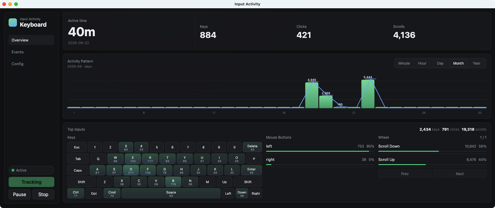

# Input Activity

> AI工具用的越多。自己干的活越少。但你干活多少到底有没有一个衡量标准？一个最简单的办法就是统计键盘的按键次数，所以诞生了这个项目。

Input Activity 是一个记录电脑键盘和鼠标使用情况的小工具。

它可以帮你看到今天按了多少次键盘、点了多少次鼠标、滚动了多少次滚轮，以及大概在电脑前活跃了多久。

## 它能做什么

- 记录键盘按键次数。
- 记录鼠标点击和滚轮次数。
- 按分钟、小时、天查看使用频率。
- 用键盘热力图展示哪些键按得最多。
- 估算你今天在电脑前活跃的时间。

它不会记录你输入的文字内容，只记录类似“按下了某个键”“点击了鼠标左键”这样的操作信息。数据保存在本机。

## 如何使用

1. 打开 `Input Activity.app`。
2. 如果系统提示需要权限，请允许“辅助功能 / Accessibility”权限。
3. 点击左侧的 `Start` 开始记录。
4. 在 `Overview` 页面查看今天的统计。
5. 在 `Events` 页面查看原始操作记录。
6. 在 `Config` 页面选择界面主题。

如果你关闭了窗口，应用可能仍在菜单栏运行。可以点击 macOS 右上角菜单栏里的 Input Activity 图标重新打开窗口。

## 常见按钮

- `Start`：开始记录。
- `Pause`：暂停记录。
- `Stop`：停止记录并保存已有数据。
- `Config`：调整界面主题。

## 权限说明

macOS 需要你允许应用读取键盘和鼠标操作。没有这个权限时，应用无法开始记录。

如果无法启动记录，请打开：

`系统设置 -> 隐私与安全性 -> 辅助功能`

然后允许 `Input Activity`。

## 开发者文档

如果你想了解如何运行源码、测试、打包或修改项目，请阅读：

[docs/developer-guide.md](docs/developer-guide.md)
